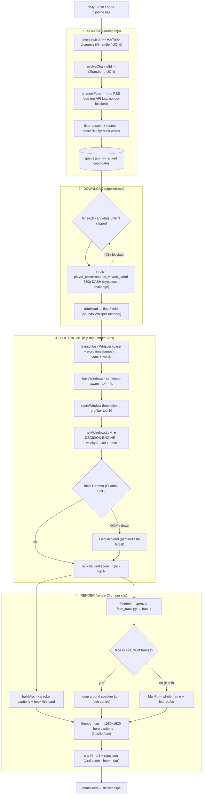

# Clip Factory — Pipeline

One long video → many short, vertical, captioned clips. Trigger: daily 09:30 (scheduled) or `node pipeline.mjs`.

## Files
- `source.mjs` — channel RSS discovery + clip-worthiness title ranking → `queue.json`
- `pipeline.mjs` — orchestration: discover → download (yt-dlp) → trim → clip; resilient (skips blocked/failed candidates)
- `clip.mjs` — the engine: transcribe → window → rank (LLM) → render. Library + CLI (`node clip.mjs <file> [n]`)
- `face_track.py` — OpenCV face detection for smart framing (crop vs blur)
- `digest.mjs` — daily discovery digest (the "what to clip" list)

## Schedule
- 09:00 — `digest.mjs` (discovery list)
- 09:30 — `pipeline.mjs` (download + clip the top candidate)
